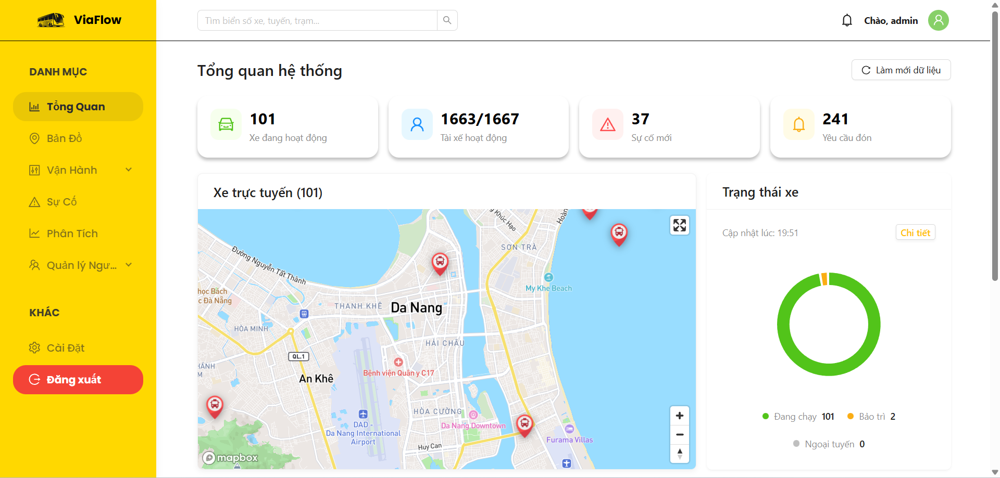
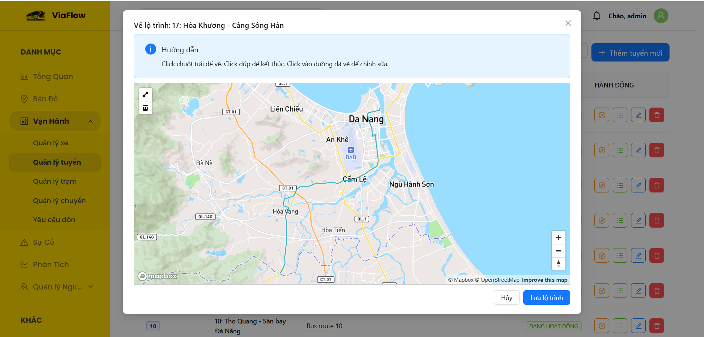
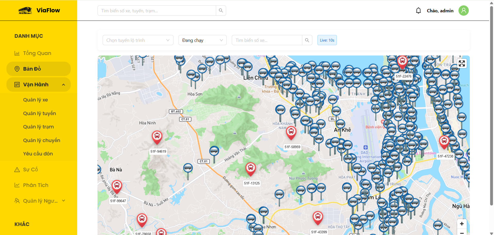
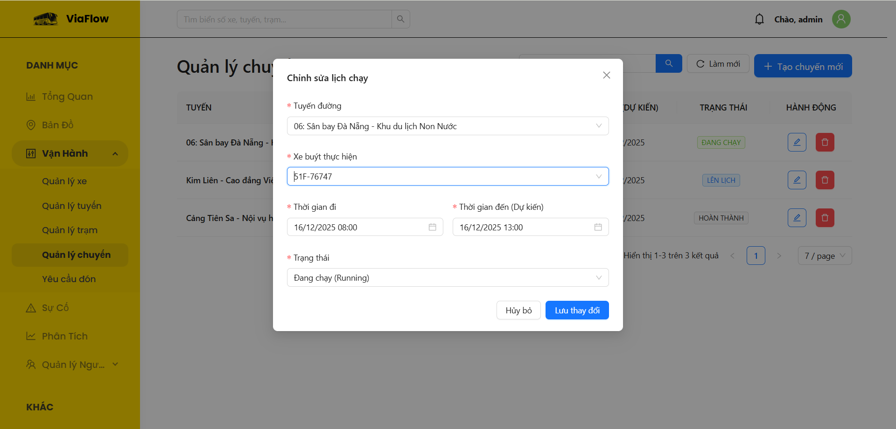
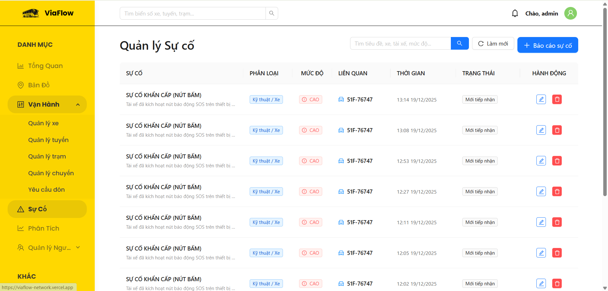

# 🚌 Internal Bus Management Dashboard (ViaFlow)




> A comprehensive bus operation management solution, ranging from fleet management and scheduling to complex geospatial route planning and operational incident tracking.
---

## 🚀 Live Demo

Experience the project directly at: **https://viaflow-network.vercel.app/**

**Demo Admin Credentials:**
* **Email:** `admin@bus.com`
* **Password:** `admin123`

---

## ✨ Key Features

The system is modularized into specialized operational components:

### 1. 📡 Real-time Fleet Tracking
* **Live Monitoring:** visualizes the real-time location of active buses on the map.
* **Auto-Refresh:** Locations update automatically every 10 seconds.
* **Smart Filtering:** Filter buses by specific Routes, License Plates, or Operational Status.

### 2. 🗺️ Fleet Management
* Track vehicle list (License plates, Seat capacity, Vehicle type).
* Assign vehicles to fixed routes.
* Update operational status (Active / Maintenance / Out of Service).

### 3. 🗓️ Routes & Trips Management
* **Routes:** Manage static paths (Departure - Destination).
* **Trips:** Schedule specific journeys by date and time.
* **Smart Logic:** Automatically resolves relations to display Route/Bus names instead of raw IDs.

### 4. 🎫 Pickup Request Handling
* Receive booking requests from customers.
* Admin Dashboard for quick actions: **Approve** / **Reject**.
* Visual status tracking via color-coded Tags.
* Multi-dimensional information display: Customer (Avatar, Phone) - Location - Trip details.

### 5. ⚠️ Incident Management
* **Hybrid Schema:** Manages both **Vehicle Incidents** (Mechanical issues) and **Personnel Incidents** (Sick leave, Driver issues) within a unified interface.
* Severity classification (`Low` -> `Critical`).
* Incident resolution workflow (`Open` -> `Processing` -> `Resolved`).

---

## 🛠 Tech Stack

### Frontend
* **Core:** [ReactJS](https://reactjs.org/) + **Vite** (Optimized build tool).
* **UI System:** [Ant Design](https://ant.design/).
* **Maps:** `react-map-gl`, `@mapbox/mapbox-gl-draw`.
* **PocketBase SDK:** Handling API requests and Real-time data.
* **Day.js:** Precise date and time formatting.

### Backend
* **PocketBase:** A lightweight backend (Golang + SQLite) handling Real-time subscriptions, Auth, and Database relationships.

---

## 📸 Screenshots

| Route Drawing (Mapbox) | Real-time Tracking |
|:---:|:---:|
|  |  |

| Trip Scheduling | Incident Management |
|:---:|:---:|
|  |  |
---

## ⚙️ Installation & Local Setup

If you want to run this project locally:

**Step 1: Clone the repository**
```bash
git clone https://github.com/br1anx291/bus_network.git
cd bus-network
````

**Step 2: Install dependencies**

```bash
npm install
```

**Step 3: Environment Configuration**
Create a `.env` file in the root directory and add your Backend URL:

```env
# Mapbox Token (Required for Maps)
VITE_MAPBOX_TOKEN=pk.eyJ1IjoieW91ci.....

# Backend API URL
VITE_POCKETBASE_URL="[https://your-backend.pockethost.io]"
```

**Step 4: Run the application**

```bash
npm run dev
```

Access `http://localhost:5173` to view the app.

-----

## 📂 Database Schema

The project utilizes a Relational Data Model hosted on PocketBase:

  * **`vehicles`**: Vehicle information.
  * **`routes`**: Fixed route paths.
  * **`trips`**: Intermediate table connecting `vehicles` and `routes` based on time (`start_time`).
  * **`pickup_requests`**: Links `users`, `trips`, and `stations`.
  * **`incidents`**: A polymorphic table linking to either `vehicles` or `users` based on the incident category.

